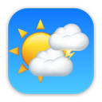

## V7-WeatherKit - Data Persistence and App Icon

This repository contains the source code for the entire series on WeatherKit with SwiftData integration.

Each video in the series has its own branch so if you have not started from the beginning, make sure that you clone or download the correct branch for the video.

This is the branch for the completed code for the 7th and final video in the series. 

If you want to support my work, you can -  

